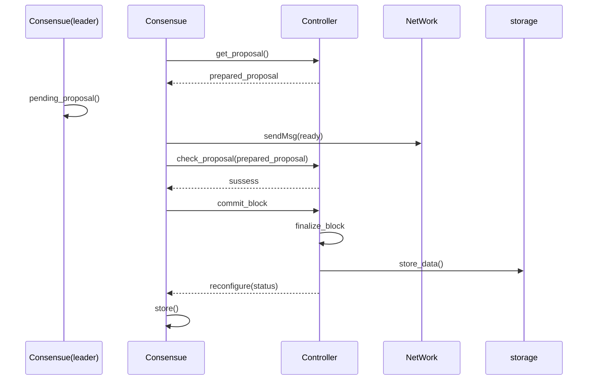

# controller

## build

```
cargo build --release
```

## build docker image

```
docker build -t citacloud/controller .
```

## install

```
cargo install --path ./
```

## related config in config.toml

1. `config.toml`-`[controller]`配置其他微服务的端口以及`key_id`和`node_address`。示例如下：

   ```toml
   [controller]
   consensus_port = 50001
   controller_port = 50004
   executor_port = 50002
   key_id = 1
   kms_port = 50005
   network_port = 50000
   node_address = '262a554f4a34884aa1c2ec04786349ee9c62fb98'
   package_limit = 30000
   storage_port = 50003
   ```

2. `config.toml`-`[genesis_block]`配置创世块相关的信息。示例如下：

   ```toml
   [genesis_block]
   prevhash = '0x0000000000000000000000000000000000000000000000000000000000000000'
   timestamp = 1642573944688
   ```

3. `config.toml`-`[system_config]`配置初始的系统配置信息。示例如下：

   ```toml
   [system_config]
   admin = '5b0618082d6ac17fb755463f9e509bf515d93ae2'
   block_interval = 3
   block_limit = 100
   chain_id = '63586a3c0255f337c77a777ff54f0040b8c388da04f23ecee6bfd4953a6512b4'
   validators = [
      '262a554f4a34884aa1c2ec04786349ee9c62fb98',
      'c377f99f31d42f0709587a13381c8a5c134ecb4c',
   ]
   version = 0
   ```

## 使用方法

```shell
$ controller -h
controller 6.3.2
Rivtower Technologies.
This doc string acts as a help message when the user runs '--help' as do all doc strings on fields

USAGE:
    controller <SUBCOMMAND>

OPTIONS:
    -h, --help       Print help information
    -V, --version    Print version information

SUBCOMMANDS:
    git     print information from git
    help    Print this message or the help of the given subcommand(s)
    run     run this service
```

### controller git

打印`git`相关的信息

```shell
$ controller git
git version: 8fedf45-modified
homepage: https://github.com/cita-cloud/controller
```

### controller run

运行`controller`服务。

```shell
$ controller run -h
controller-run 
run this service

USAGE:
    controller run [OPTIONS]

OPTIONS:
    -c, --config <CONFIG_PATH>    Chain config path [default: config.toml]
    -h, --help                    Print help information
    -l, --log <LOG_FILE>          log config path [default: controller-log4rs.yaml]
```

参数：
1. 微服务配置文件。

    参见示例`example/config.toml`。

    其中：
    * `consensus_port` 是共识微服务的gRPC端口
    * `controller_port` 是控制器微服务的gRPC端口
    * `executor_port` 是执行器微服务的gRPC端口
    * `kms_port` 是kms微服务的gRPC端口
    * `network_port` 是网络微服务的gRPC端口
    * `storage_port` 是存储微服务的gRPC端口

2. 日志配置文件。

    参见示例`controller-log4rs.yaml`。

    其中：

    * `level` 为日志等级。可选项有：`Error`，`Warn`，`Info`，`Debug`，`Trace`，默认为`Info`。
    * `appenders` 为输出选项，类型为一个数组。可选项有：标准输出(`stdout`)和滚动的日志文件（`journey-service`），默认为同时输出到两个地方。

```shell
$ controller run -c example/config.toml -l controller-log4rs.yaml
2022-03-09T11:53:21.015943+08:00 INFO controller - grpc port of this service: 50004
2022-03-09T11:53:24.023215+08:00 INFO controller - register network msg handler success!
2022-03-09T11:53:24.025524+08:00 INFO controller - kms(sm) is ready!
2022-03-09T11:53:24.025583+08:00 INFO controller - load sys_config
2022-03-09T11:53:24.028314+08:00 INFO controller - get current block number success!
2022-03-09T11:53:24.028346+08:00 INFO controller - this is a new chain!
2022-03-09T11:53:24.028927+08:00 INFO controller - current block number: 0, current block hash: ...
2022-03-09T11:53:24.029761+08:00 INFO controller - lock_id: 1000 empty, store from config to local
2022-03-09T11:53:24.030727+08:00 INFO controller - lock_id: 1001 empty, store from config to local
2022-03-09T11:53:24.031320+08:00 INFO controller - lock_id: 1002 empty, store from config to local
2022-03-09T11:53:24.031872+08:00 INFO controller - lock_id: 1003 empty, store from config to local
2022-03-09T11:53:24.032435+08:00 INFO controller - lock_id: 1004 empty, store from config to local
2022-03-09T11:53:24.033142+08:00 INFO controller - lock_id: 1005 empty, store from config to local
2022-03-09T11:53:24.033722+08:00 INFO controller - lock_id: 1006 empty, store from config to local
2022-03-09T11:53:24.034156+08:00 INFO controller - load sys_config complete
2022-03-09T11:53:24.034186+08:00 INFO controller::controller - node address: ...
2022-03-09T11:53:24.034560+08:00 INFO controller::chain - finalize genesis block
2022-03-09T11:53:24.038520+08:00 INFO controller::chain - exec_block(0): status: Success, executed_block_hash: [...]
2022-03-09T11:53:24.040881+08:00 INFO controller::chain - finalize_block: 0, block_hash: ...
2022-03-09T11:53:24.040900+08:00 INFO controller::chain - executor is ready!
2022-03-09T11:53:24.041611+08:00 INFO controller::controller - init_block_number: 0
2022-03-09T11:53:24.043737+08:00 INFO controller::controller - reconfigure consensus success!
2022-03-09T11:53:24.043782+08:00 INFO controller - start grpc server!
...
```

## 设计

### 概述

`Controller`微服务在整个区块链中处于核心的位置，主导所有主要的流程，并给上层用户提供RPC接口。

接口除了针对`Consensus`微服务的接口，就是针对上层用户的RPC接口。其中最重要的是`SendRawTransaction`发送交易接口，剩下的都是一些信息查询接口。

单独就这个微服务来说，可以认为是一个提案管理系统。用户通过发送交易接口，提交原始交易数据，`Controller`管理这些原始交易数据。通过计算原始交易数据的哈希，组装`CompactBlock`，以及再次哈希，形成`Consensus`需要的提案，管理这些提案。这里所说的管理，包括持久化，同步，以及验证其合法性。

### 主要模块介绍

#### genesis
创世块本质是一个配置文件，里面配置了高度为0的创世块的内容。创世块里只有timestamp和prevhash两项内容，其它配置有另外单独的配置文件。

初始化的时候会读取配置文件，然后生成相应的块结构。

#### utxo_set
本实现的区块链系统同时支持account和utxo两种类型的交易。但是utxo类型的交易只用于系统配置管理。

初始化时需要一个单独的初始系统配置，给系统配置项赋予初值。

在一个块确认之后，如果发现有utxo类型的交易，会调用本模块的update函数更新系统配置。

#### pool

交易池负责维护尚未确认的交易。本实现就简单的使用HashSet来保存这些交易的hash，另外有一个HashMap给每笔交易赋予一个序号。

交易池直到块最终确认（后面累计block_delay_number个后续块），才会将交易从交易池中删除。

为了尽量避免打包重复的交易，打包交易的时候是随机选择交易的。具体做法是随机选择一个开始的序号，然后往后顺序扫描，直到没有交易，或者交易数量达到打包上限。

#### auth

auth主要负责检查交易的合法性，包括交易中每个字段的合法性，以及与历史交易是否重复。auth会保存最近100个历史块中的交易hash。

对于utxo类型的交易的交易，还要校验prevhash是否正确。

#### chain

chain主要是维护了一个管理未最终确认块的fork_tree。因为链的未确认部分长度是确定的（block_delay_number），因此fork_tree是一个HashMap，以index（块高-已经确认的最高块高）为key。其总长度为block_delay_number * 2 + 2，主要是考虑节点落后的情况下，可以尽量多的同步未来的候选块，加快同步的速度。

本实现比较简单，并没有分叉链之间切换的逻辑。而是在一个块得到确认之后，按照prevhash临时找出对应的分叉链。如果该分叉链比之前的主链要长，则进行替换，并更新一些相关的状态。

如果新的主链长度大于block_delay_number，则多出的部分最老的块得到最终确认，会将相关信息写入storage，并更新当前块高/块hash等信息。

新确认的块有两个来源：一个是共识微服务通过commit_block提交的块，另外一个是同步过来的块。只不过共识提交的确认块在未最终确认的区域，而同步过来的块是已经最终确认的。同步块的处理基本与上述相同，额外的会清理掉当前的主链，因为最新的当前块变化之后，原来的主链肯定跟它连不上了。

候选块除了刚启动初始化时会主动增加，后续是每次有新的块最终确认才会增加新的候选块。同步块的处理没有这个操作，因为处于同步状态意味着本节点落后了，那么主链和候选块很可能是没有意义的。

### 出块实现过程



> 其中还实现了 WAl(Write Ahead Log 预写日志) 来保障出块过程的原子性：
> 每次进行最终化区块(chain-finalize_block)的操作时会先将相关信息写入wal(chain-wal_save_message)，在完成最终化之后再将相关信息清除(wal-clean_file)，这样如果在操作过程中发生异常情况导致操作中断，操作的相关信息仍然保留在wal中，再次启动controller时(controller-init)会读取wal中的内容(chain-load_wal_log)，若读到其中有finalize_block操作证明上次程序在最终化区块过程中发生异常导致操作中断，则根据wal中的相关信息继续完成操作，若未读到则正常启动。

